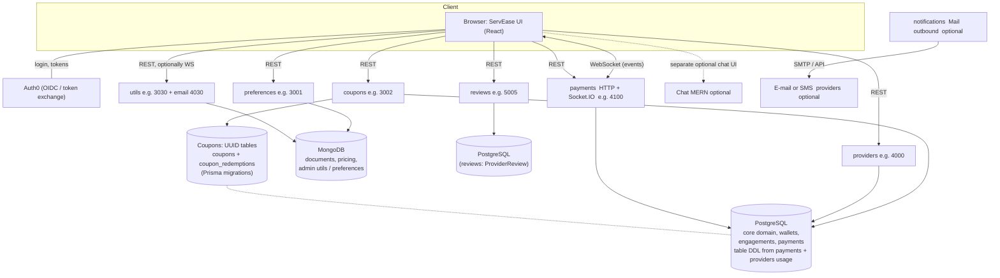
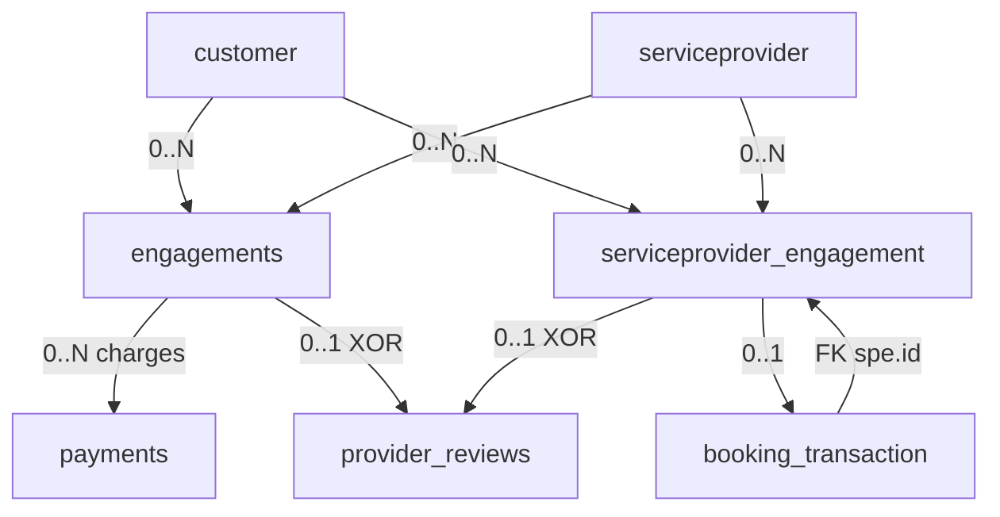
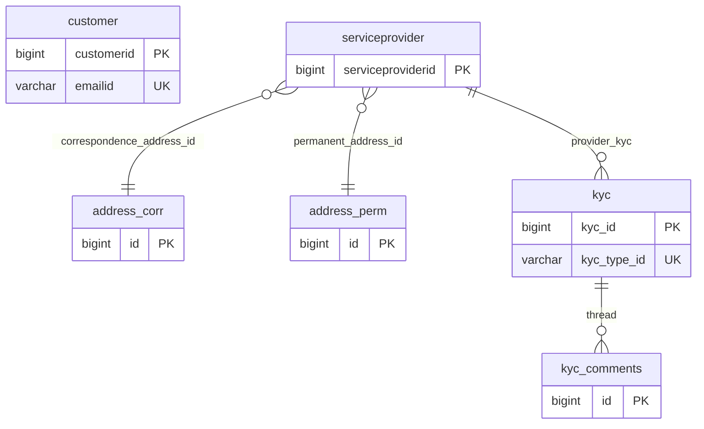
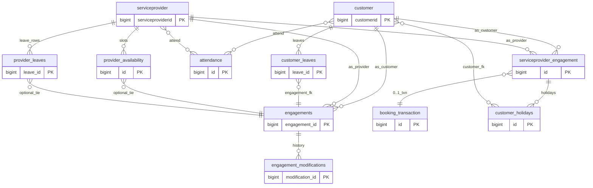
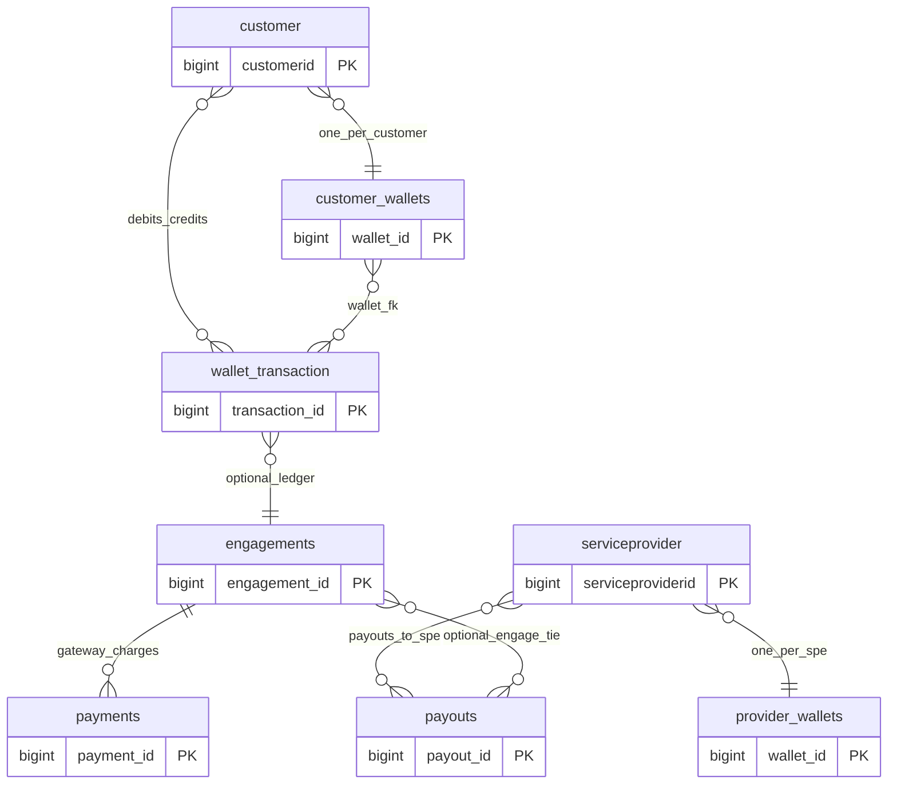
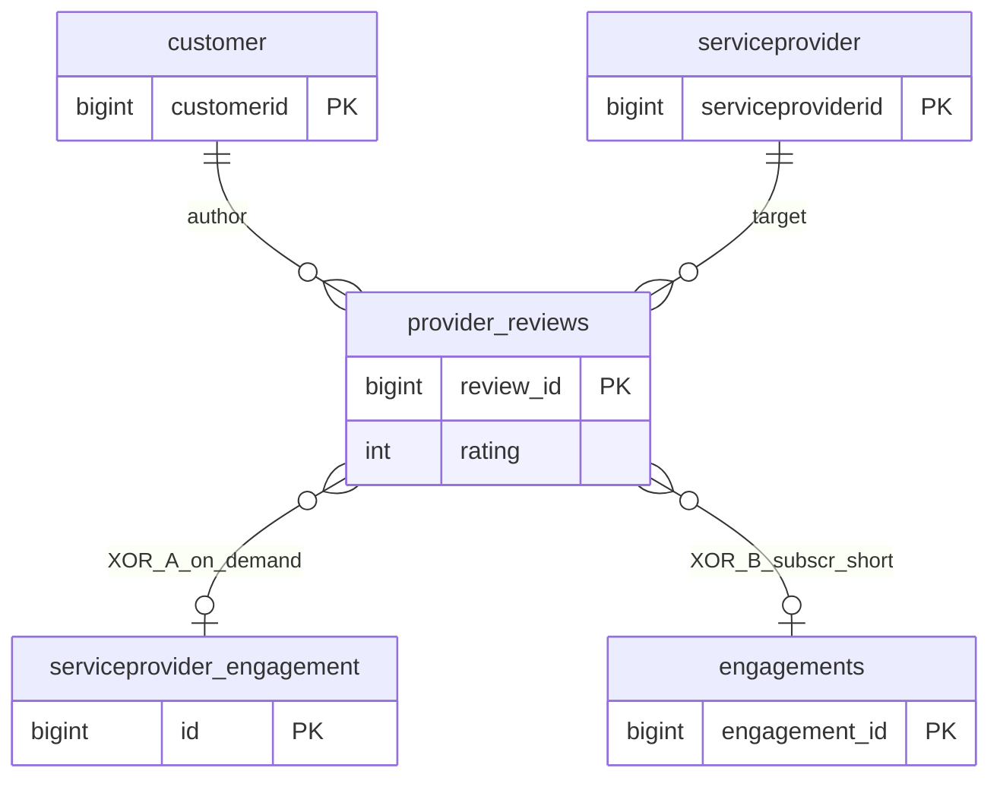
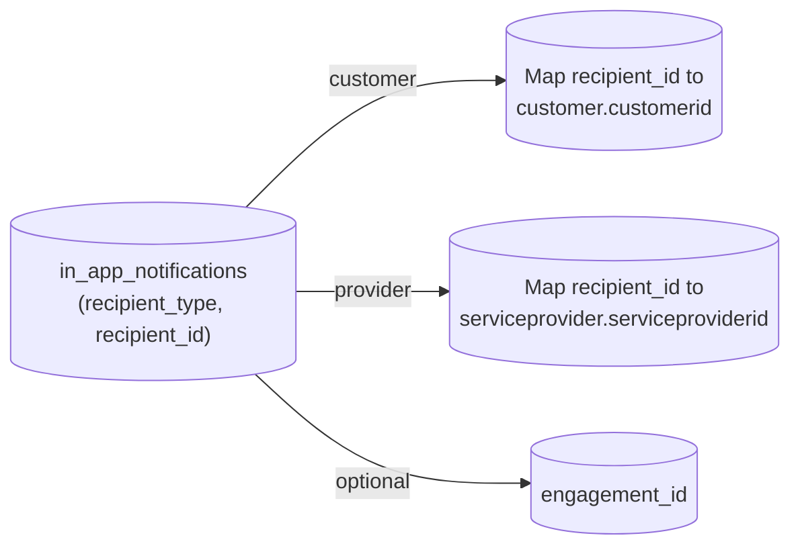
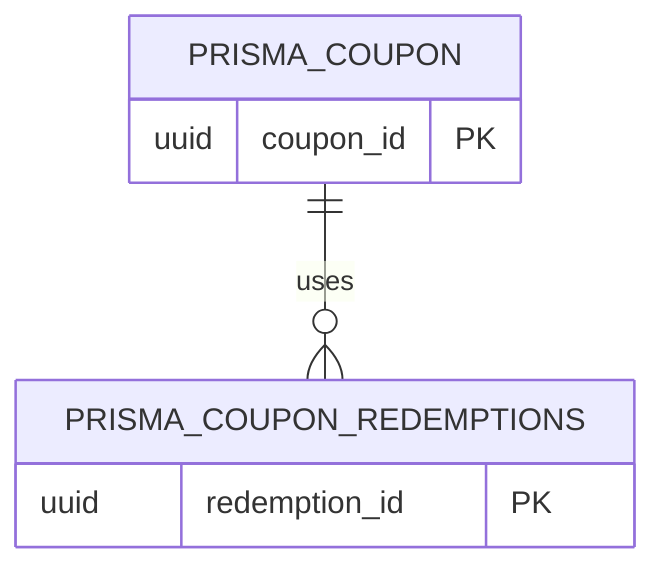
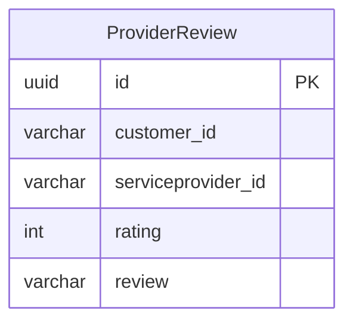

# Serveaso monorepo (backend + UI)

Official umbrella repository: [ServEase-Innovations/Serveaso](https://github.com/ServEase-Innovations/Serveaso). Licensed under the MIT License — see [LICENSE](LICENSE).

This **parent** repository uses **Git submodules** to pin the backend services and the web app. Each submodule keeps its own history, release cadence, and can be developed or deployed on its own.

| Path | Role | Submodule remote |
| ---- | ---- | ---------------- |
| `services/payments` | Payments, engagements, wallets, Socket.IO | [ServEase-Innovations/payments](https://github.com/ServEase-Innovations/payments) |
| `services/preferences` | User preferences (MongoDB) | [ServEase-Innovations/preferences](https://github.com/ServEase-Innovations/preferences) |
| `services/providers` | Providers, customers, vendors (PostgreSQL) | [ServEase-Innovations/providers](https://github.com/ServEase-Innovations/providers) |
| `services/coupons` | Coupons & redemptions (PostgreSQL / Prisma) | [ServEase-Innovations/coupons](https://github.com/ServEase-Innovations/coupons) |
| `services/utils` | Email helpers, uploads, admin/Mongo utilities, WebSockets | [ServEase-Innovations/utils](https://github.com/ServEase-Innovations/utils) |
| `services/notifications` | Mail / notification sending (code under `Mail/`) | [ServEase-Innovations/notifications](https://github.com/ServEase-Innovations/notifications) |
| `services/chat` | Real-time chat (MERN: `backend/`, `frontend/`) | [ServEase-Innovations/chat](https://github.com/ServEase-Innovations/chat) |
| `services/reviews` | Reviews service (TypeScript, Prisma, PostgreSQL) | [ServEase-Innovations/reviews](https://github.com/ServEase-Innovations/reviews) |
| `apps/servase-ui` | **React (CRA) + TypeScript** customer UI for Servease | [ServEase-Innovations/ServEase_UI](https://github.com/ServEase-Innovations/ServEase_UI) |

## System architecture

**ServEase** is a **monorepo of submodules** (one Git history per app). The **web UI** runs in the browser, authenticates with **Auth0 (OIDC)**, and calls **backends over HTTPS**. **Payments** also exposes a **WebSocket (Socket.IO)** for live updates (e.g. new engagements, in-app events). In local development, the UI targets several localhost ports; see the [Run locally](#run-locally) table. In production, each service is deployed with its own base URL, wired through environment variables.

The diagram is a high-level view; a given deployment may add API gateways, split databases, or host only a subset of services.



- **Synchronous data:** Most reads/writes are **JSON REST** from the UI to the service that owns the route. Cross-service work is not orchestrated by a BFF; services call the DB or, where implemented, one another.
- **Real time:** The **payments** app keeps **Socket.IO**; clients and server `join` rooms (e.g. by `customerId` / `providerId`) to receive real-time events that mirror or complement in-app and notification flows.
- **Third-party (not drawn):** Payment providers (e.g. Razorpay on **payments**), SMS/WhatsApp, maps, and email SMTP live behind individual services when configured in each repo’s env.

## Data stores and database design

Each service ships its own **connection string and migrations**. In **local** setups, a single [Docker Compose](docker-compose.yml) can run one **Postgres** (`serveaso`) and one **Mongo**; in **production**, you may use separate clusters per service. The list below is the *logical* design; **columns, constraints, and indexes** are in the SQL/Prisma files linked in each subsection.

| Store | Typical engine | What it holds |
| ----- | -------------- | ---------------- |
| Core + payments domain | **PostgreSQL** | Customers, providers, engagements, wallets, payment rows, notifications, and related tables in [`schema.sql`](services/payments/src/config/db/schema.sql) (plus [patch migrations](services/payments/src/config/db/migrations/)) |
| Promo (coupons service) | **PostgreSQL** (often same host/DB) | Prisma `coupons` (UUID) + `coupon_redemptions` — [migrations](services/coupons/prisma/migrations/) |
| Standalone reviews API | **PostgreSQL** (often a separate `DATABASE_URL`) | `ProviderReview` — [Prisma](services/reviews/prisma/schema.prisma) |
| Preferences + admin utilities | **MongoDB** | Documents for preferences, pricing/records, settings — per service `MONGO_URI` / Mongoose in **utils** |
| FCM device tokens (push) | **MongoDB** | Collection **`devicetokens`** in **utils** — see [FCM setup](services/utils/README.md#firebase-cloud-messaging-fcm) |

### Push notifications (FCM)

Mobile push and admin broadcast are implemented in the **utils** submodule:

- **Register tokens:** `POST /api/push/register` (iOS/Android app after login).
- **Send (admin):** `POST /api/push/send` with `X-Admin-Push-Secret`.
- **Storage:** MongoDB `devicetokens` (Mongoose `DeviceToken` model).
- **Delivery:** Firebase Admin SDK (`firebase-admin`).

Full setup (Firebase project, service account, env vars, API reference, mobile + admin UI): **[`services/utils/README.md` → Firebase Cloud Messaging](services/utils/README.md#firebase-cloud-messaging-fcm)**.

### Entity-relationship diagrams (ERD)

**How to read this section**

- Each diagram is **Mermaid**; GitHub renders it. If you edit locally, [validate syntax](https://mermaid.js.org/syntax/entityRelationshipDiagram.html).
- **Tables** are shown with a few key columns. Full definitions are in the linked SQL/Prisma files.
- The **same PostgreSQL** often holds *two* booking “tracks”:
  - **`engagements`**: longer or structured contracts (e.g. monthly) — see FKs in [`schema.sql`](services/payments/src/config/db/schema.sql) `REFERENCES public.engagements`.
  - **`serviceprovider_engagement`**: on-demand or legacy per-row bookings — e.g. **`booking_transaction.engagement_id` → `serviceprovider_engagement.id`**, not to `engagements.engagement_id` (see `fkkivwnnxvqx05mibfdqqlwjtxl` in the schema file).
- **`in_app_notifications`** has **no polymorphic foreign key** in the migration; the app matches `recipient_id` to `customer` or `serviceprovider` by `recipient_type`.
- **Vendor / users / `user_credentials`** are real tables; cross-links may be app-level. See the **Table inventory** subsection that follows the diagrams.

#### 1) Domain map (read this first)



*A single `provider_reviews` row links to **either** an `engagements` row **or** a `serviceprovider_engagement` row, enforced by a database CHECK; see ERD 5.*

#### 2) ERD: identity, addresses, KYC

`serviceprovider` can reference **`address` twice** (correspondence vs permanent), modeled below as two nodes that both represent the same `address` table (two FKs).



*No direct `customer` ↔ `serviceprovider` row in the identity diagram — they are linked in **booking and review** tables (see ERD 3 and 5).*

#### 3) ERD: bookings, attendance, calendar rows



#### 4) ERD: wallets and platform money movement

`wallet_transaction` and `wallet_transactions` are two tables in the same schema (historical naming). Use live code to see which path is used for new money.



#### 5) ERD: `provider_reviews` (mutually exclusive booking link)

**Rule:** `serviceprovider_engagement_id` **XOR** `engagement_id` (exactly one) — `one_experience_only` in the DDL.



#### 6) In-app notifications (polymorphic, no `FOREIGN KEY` in migration)



See [`in_app_notifications.sql`](services/payments/src/config/db/migrations/in_app_notifications.sql).

#### 7) ERD: promo `coupons` (Prisma, UUID) + `coupon_redemptions`

*Different from* the legacy `coupons` (bigint) row in the old `schema.sql` dump.



Authoritative: [`services/coupons/prisma/migrations/`](services/coupons/prisma/migrations/).

#### 8) ERD: microservice `ProviderReview` (separate `DATABASE_URL` in many envs)



See [`services/reviews/prisma/schema.prisma`](services/reviews/prisma/schema.prisma).

#### 9) MongoDB (not relational ERD in Postgres sense)

- **Preferences:** documents keyed for user-specific settings; connection in [`services/preferences/config/db.js`](services/preferences/config/db.js).
- **Utils:** document collections (e.g. **pricing/records** for the UI, admin, uploads); not drawn here.

### Table inventory: core `schema.sql`

These tables are defined in [`services/payments/src/config/db/schema.sql`](services/payments/src/config/db/schema.sql) (or applied by the same app’s [init / migrations](services/payments/src/config/db/migrations/)). Names are as in the database; some pairs look similar by history (e.g. `wallet_transaction` vs `wallet_transactions`).

| Area | Tables |
| ---- | ------ |
| **Parties and identity** | `address`, `customer`, `serviceprovider`, `vendor`, `users`, `user_credentials` |
| **KYC and provider ops** | `kyc`, `kyc_comments`, `leave_balance`, `service_provider_leave` |
| **Engagements and booking** | `engagements`, `engagement_modifications`, `serviceprovider_engagement`, `booking_transaction`, `provider_availability`, `provider_leaves`, `shortlisted_service_provider` |
| **Customer-side flows** | `customerrequest`, `customerrequestcomment`, `customer_holidays`, `customer_leaves`, `customerconcern`, `customer_payments` (subscription-style rows), `customer_used_coupons`, `service_provider_used_coupons` |
| **Provider-side flows** | `serviceproviderrequest`, `service_provider_request_comments`, `service_provider_payment` |
| **Field operations** | `attendance` |
| **Care / feedback (legacy rows)** | `service_provider_feedback`, `customerfeedback` |
| **Wallets and money** | `customer_wallets`, `wallets` (alt naming), `wallet_transaction`, `wallet_transactions`, `payments`, `payouts` |
| **Provider wallet** | `provider_wallets` |
| **Reviews (core DB)** | `provider_reviews` (same-name concept as the separate reviews service model; do not assume identical columns without diffing) |
| **Misc** | `coupons` (legacy `bigint` style in this snapshot), `in_app_notifications` (also in **migration** file below) |

**Applied outside the single `schema.sql` file:** [`in_app_notifications.sql`](services/payments/src/config/db/migrations/in_app_notifications.sql) ensures the in-app table exists and indexes unread rows.

**Providers and others** in dev usually point the same `DATABASE_URL` at this database so they read/write **shared** rows. Route ownership is by service; **data model** is documented here.

### PostgreSQL: coupon promotion engine (Prisma, UUID)

The **coupons** app adds a **separate** coupon model (UUID `coupon_id`, enums, rules) and **`coupon_redemptions`**. Authoritative DDL is in [`services/coupons/prisma/migrations/`](services/coupons/prisma/migrations/). The legacy **`public.coupons`** row in `schema.sql` (different shape) can coexist in old databases; for **new** promo work, use the **Prisma**-managed tables. If you deploy to a **fresh** single database, ensure migration order does not name-collide without a plan.

| Table | Role |
| ----- | ---- |
| `coupons` (UUID) | Code, window, `DiscountType` / `ServiceType`, usage limits, city, etc. |
| `coupon_redemptions` | Reserve / apply / release against `user_id` and optional `engagement_id`, expiry, discount amount, metadata jsonb |

### PostgreSQL: reviews microservice

Single primary model, separate connection string is common in production (see [schema](services/reviews/prisma/schema.prisma)):

| Field (concept) | Use |
| --------------- | --- |
| `ProviderReview` | `customer_id`, `serviceprovider_id`, optional `engagement_id` / `booking_id`, `service_type`, `rating`, `review`, `created_at` |

### MongoDB: documents and utilities

- **Preferences** — user-scoped JSON documents: [`services/preferences/config/db.js`](services/preferences/config/db.js) (`MONGO_URI`, `DB_NAME`).
- **Utils** — collections for **pricing/records** (e.g. imports the UI can read on first load), **user settings**, and admin; connection is configured in `services/utils` (never commit real URIs; use env in deployment).

The **UI**’s “initial load” often hits **utils** (pricing/records) while **booking** and **wallets** use the **Postgres** APIs (payments, providers) as above.

The **root** uses **npm workspaces** only for `services/*`. The UI app has a **separate** `node_modules` under `apps/servase-ui` to avoid clashing with backend dependency hoisting.

## Web UI (ServEase_UI)

```bash
cd apps/servase-ui
npm install
npm start
# or from repo root:
npm run dev:ui
```

- Default dev server: **http://localhost:3000** (per Create React App).
- For **local + monorepo backends**, copy `apps/servase-ui/.env.local.example` to `apps/servase-ui/.env.local` (defaults match `npm run dev` ports; see `src/config/urls.ts`).
- For **QA / production**, use that project’s **`.env.qa`** / deployment env (do not commit secrets).
- The UI is **not** required to run the backend microservices.

### Is it a good idea to keep the UI in this repo?

**Reasons to keep it (submodule):** one `git clone --recurse-submodules` gets a **full stack** for onboarding; a single “platform” commit can **pin** API + UI versions for reproducible QA. **Submodules** preserve separate GitHub projects and access control, unlike copying source into one flat tree.

**Reasons to split:** the UI and APIs often **release on different schedules**; CI can get heavier; very large `npm install` in the UI is separate from the backend (which you already have by not using workspaces for `apps/*`).

A common pattern is: **this layout for local / integration work**, and **independent deploy pipelines** per `ServEase_UI` and each API repo in production. Submodules are optional: you can remove the submodule and clone the UI elsewhere if the team prefers two checkouts.

## Clone (with submodules)

```bash
git clone --recurse-submodules <your-monorepo-url> Serveaso-BE
cd Serveaso-BE
```

If you already cloned without submodules:

```bash
git submodule update --init --recursive
```

Update all submodules to the commits recorded by the parent repo:

```bash
git submodule update --init --recursive
```

Pull upstream changes for each submodule (after fetching in the submodule):

```bash
git submodule foreach 'git fetch origin && git checkout main && git pull origin main'
```

(Use each repo’s default branch name if it is not `main`.)

## Install (full monorepo)

```bash
npm install
```

Runs installs for every workspace (including submodule packages).

## Run locally

**All services** (non-clashing ports via env in the script):

```bash
npm run dev
# alias:
npm run dev:all
```

| Service | Port in `npm run dev` | Notes |
| ------- | --------------------- | ----- |
| payments | 4100 | HTTP + **Socket.IO**; `/v1/api-docs`, `/v2/api-docs` |
| preferences | 3001 | `/api-docs` |
| providers | 4000 | `/api-docs` |
| coupons | 3002 | `/api-docs`, `/metrics` |
| utils | **3030** (main + WebSocket), **4030** (email HTTP app) | Two listeners in one process; see `services/utils/.env.example` |
| reviews | 5005 | Set `PORT` in script to avoid clashing with CRA (3000) |

**One service** from the root:

```bash
npm run dev:payments
npm run dev:preferences
npm run dev:providers
npm run dev:coupons
npm run dev:utils
npm run dev:reviews
```

### Web UI (points APIs at the ports above)

From the repo root:

```bash
cp apps/servase-ui/.env.local.example apps/servase-ui/.env.local
# edit if your ports differ, then:
npm run dev:ui
```

`apps/servase-ui/src/config/urls.ts` defaults to the same localhost ports as this table. Override with `REACT_APP_*` variables in `.env.local` (see the example file).

### Troubleshooting (`npm run dev`)

| Symptom | What to do |
| --------|------------|
| **`preferences` crashes** with `Cannot read properties of undefined (reading 'startsWith')` (or Mongo connect errors) | The preferences service needs **`MONGO_URI`** in **`services/preferences/.env`** (Mongo connection string, e.g. `mongodb://localhost:27017` if you use the repo’s optional `docker compose` Mongo). Optionally set **`DB_NAME`**. The server calls `new MongoClient(process.env.MONGO_URI)`; if `MONGO_URI` is empty, the driver throws. |
| **`reviews` failed** with `ts-node-dev: command not found` | Fixed in the **reviews** submodule: dev uses **`tsx`**. From the monorepo root run **`npm install`**, then **`npm run dev`** again. The script sets **`PORT=5005`**. If you run the reviews app alone without `PORT`, the default is **5005** to avoid clashing with the React app on 3000. |
| **`payments` logs** `constraint ... for relation "..." already exists` / schema apply errors on startup | Usually harmless if the API is already up: **`initDB`** re-runs SQL against an existing database. You can ignore the message if `payments_api_started` and `http://localhost:4100` work. A proper fix is idempotent migrations (separate work). |
| **Port already in use** (EADDRINUSE) | Each service in the `npm run dev` table uses a fixed port. Stop the other process using that port, or change the **`PORT=...`** prefix in **`package.json`** and match **`apps/servase-ui/.env.local`** to the new URL. |
| **`/api-docs` on preferences (3001) returns JSON 401** with `messageId: auth.unauthorized` | The preferences app does **not** return that. Run `curl -sI http://localhost:3001/_whoami` — you should see **`X-ServeEaso-Service: preferences`**. If not, another process is on 3001 or traffic is not reaching Node; use `lsof -i :3001` and see [services/preferences/README.md](services/preferences/README.md#swagger--docs-return-401-json-with-authunauthorized). |

**One service without the monorepo** (deploy / CI pattern — only that repo matters):

```bash
cd services/providers
npm install
npm run dev
```

Each submodule can be cloned and deployed **by itself** from its own GitHub repository; the monorepo is optional for local convenience and version pinning.

## Independent deployment

Typical options:

1. **Deploy from the submodule’s remote** — Point your pipeline (GitHub Actions, ECS, etc.) at `ServEase-Innovations/payments` (or your fork). No monorepo checkout required.
2. **Deploy from the monorepo** — Checkout this repo with submodules, set the job `working-directory` to `services/payments` (or the service you need), run `npm ci` and `npm start` there. Pin the parent commit so production tracks known submodule SHAs.
3. **Docker** — Use each service’s own `Dockerfile` when present (e.g. `services/providers`); build context is that submodule directory.

Submodules do **not** force shared releases: you bump the submodule pointer in the parent only when you want the monorepo to record a new combination of versions.

## Scaling **utils** (one submodule today, optional split later)

The [utils](https://github.com/ServEase-Innovations/utils) service runs **two HTTP servers** in one Node process (main app + email routes). For local monorepo runs, **`PORT`** and **`UTILS_EMAIL_PORT`** default to **3030** and **4030** so they do not collide with preferences (3001) or providers (4000).

When you outgrow a single process, split by **creating a new repository** (for example `utils-email`), moving the `appForEmail` stack and its routes into it, and deploying that repo as its own service. Point other apps at it with an env var (for example `UTILS_EMAIL_SERVICE_URL`). You do not need multiple submodules until those repos exist; keep **one** `utils` submodule until the split is real.

## Observability (metrics, logs, Grafana)

Each submodule can expose **Prometheus** metrics at **`GET /metrics`**, write JSON lines to **`logs/app.log`**, and (optionally) run a local **Docker** stack with **Prometheus + Grafana + Loki + Promtail**.  
**Prometheus** scrapes **metrics**; **Loki** (via **Promtail**) ingests **logs**; **Grafana** visualizes both.

| Submodule | Metrics job (Prometheus) | Loki / Promtail log label | Grafana (example host port) | Compose / docs |
|-----------|-------------------------|---------------------------|----------------------------|----------------|
| **payments** | `payments-app` | `job="payments-app"` | http://localhost:3202 | `docker-compose.monitoring.yml` — [payments README](services/payments/README.md) |
| **preferences** | `preferences-app` | `job="preferences-app"` | http://localhost:3203 | `docker-compose.monitoring.yml` — [preferences README](services/preferences/README.md) |
| **providers** | `providers-app` | `job="providers-app"` | http://localhost:3205 (full stack) or 3000 (slim) | `docker-compose.observability-full.yml` — [providers README](services/providers/README.md) |
| **coupons** | `coupons-api` | `job="coupons-app"` | http://localhost:3101 | `docker-compose.monitoring.yml` — [coupons README](services/coupons/README.md) |
| **utils** | `utils-app` | `job="utils-app"` | http://localhost:3204 | `docker-compose.monitoring.yml` — [utils README](services/utils/README.md) |

**Port conflicts:** Do not run every stack at once without editing host ports in each `docker-compose*.yml`. Only one process can bind **9090** on the host, etc.

**Scrape targets:** Prometheus in Docker uses **`host.docker.internal`** to reach APIs on your machine. If your monorepo dev ports differ (e.g. payments on **4100**), edit that service’s `monitoring/prometheus/prometheus.yml` (or equivalent) `targets` before `docker compose up`.

## Environment variables

Each service keeps its own `.env`. See `.env.monorepo.example` for the default port layout when running `npm run dev` from the root.

## Optional: Postgres + Mongo (Docker)

```bash
docker compose up -d
```

- PostgreSQL: `localhost:5432`, user/password/database `serveaso`
- MongoDB: `localhost:27017`

## Layout

```
.gitmodules            # submodule URLs + paths
apps/
  servase-ui/          # submodule → ServEase_UI (React; own package-lock)
services/
  payments/            # submodule → payments repo
  ...
package.json           # npm workspaces: services/* only
docker-compose.yml     # optional local databases
```

## Port note (payments vs providers)

Both upstream **payments** and **providers** often default to port **4000**. When you run `npm run dev` from this monorepo root, **payments** is started with `PORT=4100` so it does not collide with **providers** on **4000**. If you run **payments** only inside `services/payments`, set `PORT` yourself if **providers** is also on the same machine.
