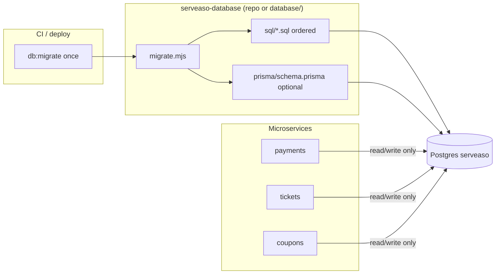

# Central database migrations

Serveaso uses **one Postgres database** (`serveaso`) for most marketplace data, while several microservices each carry their own **Prisma schema**. DDL is owned in one place:

**[ServEase-Innovations/DB_Migrations](https://github.com/ServEase-Innovations/DB_Migrations)** — git submodule at [`database/`](../database/) (see [SUBMODULE.md](../database/SUBMODULE.md))

Microservices **do not** apply migrations on startup. Run migrations from CI or locally **before** deploy.

---

## Problem today

| Source | What runs | Risk on shared DB |
|--------|-----------|-------------------|
| [`services/payments`](../services/payments/) | `schema.sql` + SQL files on **every startup** via `initDB` | Re-applies DDL; hard to audit order |
| [`services/tickets`](../services/tickets/) | `prisma migrate deploy` on startup | OK if only tickets tables; uses `_prisma_migrations` |
| [`services/coupons`](../services/coupons/) | Prisma schema = **full DB introspection** | `db push` / migrate can touch unrelated tables |
| [`services/reviews`](../services/reviews/) | Separate Prisma models (`User`, `Booking`, …) | Often a **different** database; not core `serveaso` |
| [`services/providers`](../services/providers/sql/) | Manual SQL files | Easy to forget in deploy |

**Symptom:** multiple `_prisma_migrations` (per service URL) + untracked SQL + one giant `schema.sql` snapshot.

---

## Target architecture



### Principles

1. **Migrations run once** in CI or a release job — not implicitly on every API boot (dev may still auto-run for convenience).
2. **One ordered history** per database URL:
   - SQL: `_serveaso_schema_migrations`
   - Prisma: single `_prisma_migrations` (either one merged schema or one designated service)
3. **Services do not own DDL** — they own **queries** and thin Prisma models for their tables.
4. **Coupons / tickets** keep Prisma clients locally until a shared `@serveaso/db` package exists; migration **files** live centrally.

---

## What we have now

| Piece | Status |
|-------|--------|
| [DB_Migrations](https://github.com/ServEase-Innovations/DB_Migrations) | Canonical repo (use as `database/` submodule) |
| [`database/sql/`](../database/sql/) | Consolidated SQL from payments + providers |
| [`database/prisma/tickets/`](../database/prisma/tickets/) | Support ticket Prisma migrations |
| `npm run db:baseline` | One-time core schema (`payments` `schema.sql`) if `engagements` is missing |
| `npm run db:migrate` | Runs baseline (if needed) + incremental SQL + Prisma in `database/` |
| Payments / tickets startup | **No DDL** — checks only (tickets warns if tables missing) |

### SQL apply order

0. **`000_baseline_payments_schema.sql`** (via `apply-baseline.mjs` — creates `engagements` and core tables from `services/payments/src/config/db/schema.sql`; runs automatically before SQL when you `npm run db:migrate`)
0b. **Prerequisites** — [`database/sql-dependencies.json`](../database/sql-dependencies.json) + `ensureSqlDependencies()` apply any required earlier SQL or Prisma **before** pending files (e.g. tickets before `094`)
1. `010_in_app_notifications.sql`
2. `020_pricing_plans.sql`
3. `030_engagement_status_check.sql`
4. `040_merge_serviceprovider_engagement.sql`
5. `050_providers_serviceprovider_roles.sql`
6. … (providers patches)

Add new files as `NNN_description.sql` — never change applied filenames.

When adding SQL that `UPDATE`s a table, register it in `sql-dependencies.json` (`fileRequires` / `ensureSql` / `ensurePrisma`).

### Dependency audit (who creates what)

| Tables / feature | Created by | SQL files that need it |
|------------------|------------|-------------------------|
| `engagements`, `serviceprovider`, core payments | **Baseline** (`payments/schema.sql`) | `030`, `040`, `070`, `091`, `092`, `093`, … |
| `in_app_notifications` | `010_in_app_notifications.sql` | `094` (epoch columns) |
| `pricing_plan`, `pricing_rule` | `020_pricing_plans.sql` | *(none later — standalone)* |
| `serviceprovider_roles` | `050_…sql` | *(self)* |
| `provider_*_slots` | `065_provider_slot_tables.sql` | `094` |
| `coupons` v2 + `coupon_redemptions` | `090_coupons_v2_schema.sql` | `094` (not Prisma — coupons manifest is off) |
| `service_days`, `service_day_otps` | `093_service_days_tables.sql` | `094` |
| `support_tickets*` | **Prisma `tickets`** | `094` |
| `engagement_events` | `092_engagement_events_table.sql` | *(self)* |
| `provider_ledger` | baseline **or** `095_provider_ledger.sql` | *(optional)* |

**Only cross-source ordering issue like tickets:** tables owned by **Prisma** while a **later SQL** file runs `UPDATE` on them (`094`). Coupons are covered by **`090` SQL** before `094`, not Prisma.

**Self-contained SQL** (no external prereq beyond baseline): `020`, `050`, `060`, `065`, `080`, `091`, `092`, `093`, `095`.

### Prisma (shared `serveaso`)

| Service | Manifest `migrate` | Notes |
|---------|-------------------|--------|
| **tickets** | `true` | Support ticket tables only |
| **coupons** | `false` | Enable after schema lists **only** `coupons` / `coupon_redemptions` |

---

## Separate repo: `serveaso-database`

Recommended when multiple repos (Serveaso-BE, mobile, admin) deploy against the same DB.

```
serveaso-database/
  sql/
  prisma/
    schema.prisma          # optional: full canonical schema
    migrations/            # optional: single Prisma history
  migrate.mjs
  package.json
  README.md
```

**Integration options**

| Approach | Pros | Cons |
|----------|------|------|
| **Git submodule** at `Serveaso-BE/database` | Simple; same migrate path | Submodule bump in parent PR |
| **npm package** `@serveaso/database` | Versioned releases | Publish pipeline |
| **CI artifact** | No code in app repos | Extra fetch step |

**CI step (all environments):**

```bash
npm ci --prefix database   # if packaged
node database/migrate.mjs all
# then deploy payments, tickets, …
```

---

## Fixing “multiple Prisma schemas” on one DB

### Short term (current)

- Central **SQL** in `database/sql/`.
- **Tickets**: only service allowed to `migrate deploy` on `serveaso` (see manifest).
- **Coupons**: `migrate: false` until `schema.prisma` is reduced to owned tables; use raw SQL in `database/sql/` for promo DDL until then.
- **Payments**: stop adding new files under `services/payments/.../migrations/`; use `database/sql/`.
- **Reviews**: treat as separate DB unless you intentionally merge into `serveaso`.

### Medium term

1. **Baseline migration** — replace reliance on re-running `schema.sql` with `000_baseline.sql` applied once (or Prisma introspect → single schema).
2. **Trim coupons Prisma** to:

   ```prisma
   model Coupon { ... }
   model CouponRedemption { ... }
   ```

3. **Move** `services/tickets/prisma/migrations/*` → `database/prisma/migrations/` and point tickets `schema.prisma` at `../../database/prisma/schema.prisma` (or multi-file schema).

### Long term

- One **`database/prisma/schema.prisma`** for `serveaso`.
- Publish **`@serveaso/db`** with generated client; services import subsets or the full client.
- Each service sets `prisma.schema` to a **subset** via [Prisma multi-file schemas](https://www.prisma.io/docs/orm/prisma-schema/overview/location#multi-file-prisma-schema) for codegen only — **migrations only from `serveaso-database`**.

---

## Checklist for a new schema change

1. Add `database/sql/NNN_feature.sql` (idempotent `IF NOT EXISTS` / `DO $$` blocks).
2. If Prisma-owned tables: add migration under central Prisma **or** enable service in manifest temporarily with review.
3. Run `npm run db:migrate` locally.
4. Update [`DATABASE_SCHEMA.md`](./DATABASE_SCHEMA.md) if tables/relationships changed.
5. PR includes migration file — **not** only `schema.sql` edits.
6. Production: migration job completes **before** new app version receives traffic.

---

## Related

- [`database/README.md`](../database/README.md) — commands and layout
- [`DATABASE_SCHEMA.md`](./DATABASE_SCHEMA.md) — table inventory and ERDs
- [`ENGAGEMENT_CANONICAL.md`](./ENGAGEMENT_CANONICAL.md) — engagements merge example
