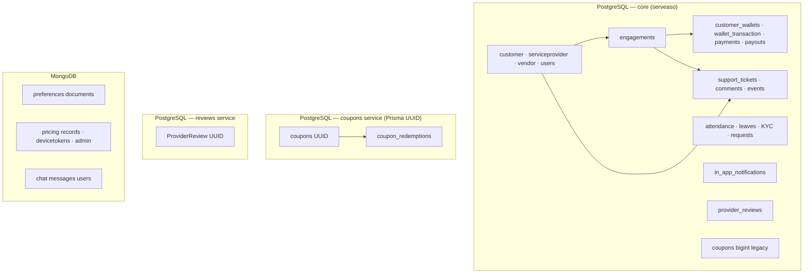
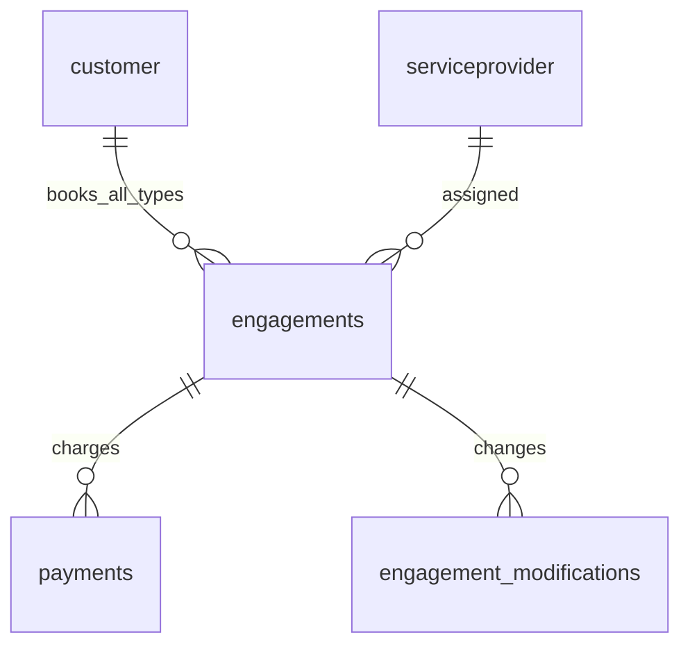
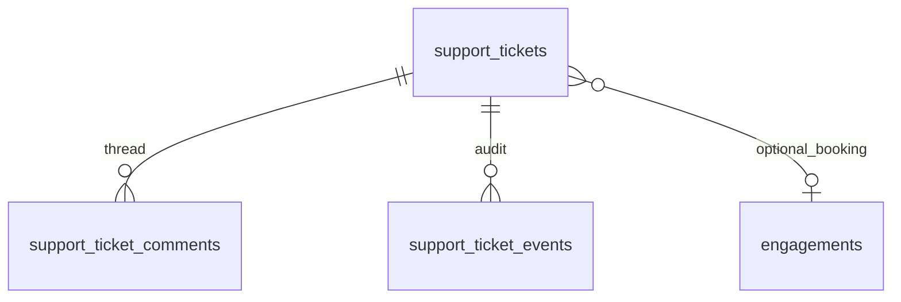

# Serveaso database schema

This document describes the **logical data model** for the Serveaso platform as implemented across the monorepo. It is written for engineers onboarding to the system, planning features, or reviewing migrations.

**Authoritative DDL** always lives in the service that owns the migration path (SQL or Prisma). This file explains how the pieces fit together, why the model looks this way, and what tradeoffs to expect.

---

## Quick map

| Store | Engine | Primary owner / migrations | Typical local connection |
| ----- | ------ | -------------------------- | ------------------------ |
| Core marketplace & money | **PostgreSQL** | [`services/payments/src/config/db/schema.sql`](../services/payments/src/config/db/schema.sql) + [migrations](../services/payments/src/config/db/migrations/) | `serveaso` DB (see [docker-compose.yml](../docker-compose.yml)) |
| Promo coupons (UUID) | **PostgreSQL** (often same DB) | [`services/coupons/prisma/`](../services/coupons/prisma/) | Same host as core |
| Support tickets | **PostgreSQL** (shared `serveaso`) | [`services/tickets/prisma/`](../services/tickets/prisma/) | Same host as core |
| Standalone reviews API | **PostgreSQL** (often separate URL) | [`services/reviews/prisma/`](../services/reviews/prisma/) | Optional second DB |
| Preferences | **MongoDB** | Mongoose in preferences service | `MONGO_URI` |
| Utils (pricing, FCM tokens, admin docs) | **MongoDB** | Mongoose in utils service | `MONGO_URI` |
| Chat | **MongoDB** (MERN submodule) | Chat `backend/` | Separate `MONGO_URI` |

---

## Architecture (logical)

Most **business truth** for bookings and settlements lives in **one PostgreSQL database** (`serveaso`). Microservices are **route owners**, not separate databases in every environment—though production *can* split URLs per service.

---

## PostgreSQL core (`schema.sql`)

Source: [`services/payments/src/config/db/schema.sql`](../services/payments/src/config/db/schema.sql)

Applied via **[`database/`](../database/)** (central SQL + Prisma manifest). Payments `initDB` runs tracked SQL on dev startup; production should use `npm run db:migrate` in CI. See **[DATABASE_MIGRATIONS.md](./DATABASE_MIGRATIONS.md)**.

### Domain areas

#### 1. Parties and identity

| Table | Purpose |
| ----- | ------- |
| `customer` | End users who book services |
| `serviceprovider` | Cooks, maids, nannies, etc. |
| `vendor` | Agent / vendor accounts |
| `users`, `user_credentials` | Admin and internal login (legacy shape) |
| `address` | Normalized addresses linked to providers |

**Relationships:** Providers and customers are the two sides of almost every booking and wallet flow.

#### 2. Engagements and booking (canonical model)

**All new bookings use one table:** `engagements` with `booking_type` ∈ `ON_DEMAND`, `SHORT_TERM`, `MONTHLY`.

| Table | Purpose |
| ----- | ------- |
| **`engagements`** | **Canonical** — all booking types (`ON_DEMAND`, `SHORT_TERM`, `MONTHLY`); all APIs use `engagement_id` |
| `engagement_modifications` | Date/time changes, refunds, penalties |
| `booking_transaction` | Payment rows (FK → `engagements.engagement_id`) |
| `provider_availability`, `provider_leaves` | Provider scheduling |
| `shortlisted_service_provider` | Customer shortlists during matching |

Legacy `serviceprovider_engagement` was merged and dropped via [`merge_serviceprovider_engagement.sql`](../services/payments/src/config/db/migrations/merge_serviceprovider_engagement.sql).

**Resolver:** [`engagementCanonical.js`](../services/payments/src/services/engagementCanonical.js) — loads by `engagements.engagement_id`.

**View:** `v_engagement_bookings` — canonical rows only.

Full guide: **[ENGAGEMENT_CANONICAL.md](./ENGAGEMENT_CANONICAL.md)**

#### 3. Customer and provider operational flows

| Area | Tables |
| ---- | ------ |
| Customer requests / concerns | `customerrequest`, `customerrequestcomment`, `customerconcern`, `customerfeedback` |
| Provider requests | `serviceproviderrequest`, `service_provider_request_comments` |
| Holidays & leaves | `customer_holidays`, `customer_leaves`, `service_provider_leave`, `leave_balance` |
| Field ops | `attendance` |
| KYC | `kyc`, `kyc_comments` |

#### 4. Wallets and money movement

| Table | Purpose |
| ----- | ------- |
| `customer_wallets` | Customer wallet balance |
| `wallet_transaction` / `wallet_transactions` | Ledger entries (historical naming duplication) |
| `wallets` | Alternate wallet naming in legacy schema |
| `payments` | Gateway charges (e.g. Razorpay) tied to engagements |
| `payouts` | Provider payouts |
| `provider_wallets` | Provider-side wallet |
| `customer_payments`, `service_provider_payment` | Subscription / provider payment records |

Design intent: **wallet ledger + gateway payments** stay queryable in SQL for reconciliation and admin tooling.

#### 5. Reviews (in core DB)

| Table | Purpose |
| ----- | ------- |
| `provider_reviews` | Ratings linked to customer + provider + `engagements.engagement_id` |

The **reviews microservice** also has a `ProviderReview` model (UUID, string IDs)—see below. Treat them as related concepts; **diff columns** before assuming one API writes to both.

#### 6. Coupons (legacy bigint in `schema.sql`)

| Table | Purpose |
| ----- | ------- |
| `coupons` | Older bigint-style coupon row in the dump |
| `customer_used_coupons`, `service_provider_used_coupons` | Usage tracking for legacy flow |

The **coupons service** adds a **modern UUID + Prisma** model—see next section. Both can coexist in long-lived databases.

#### 7. In-app notifications

| Table | Purpose |
| ----- | ------- |
| `in_app_notifications` | Rows for customer/provider notification center + Socket.IO fan-out |

Migration file: [`in_app_notifications.sql`](../services/payments/src/config/db/migrations/in_app_notifications.sql)

| Column | Notes |
| ------ | ----- |
| `recipient_type` | `'customer'` \| `'provider'` |
| `recipient_id` | Maps to `customer.customerid` or `serviceprovider.serviceproviderid` — **no FK in DDL** |
| `engagement_id` | Optional context for booking-related alerts |
| `metadata` | JSONB for UI payloads (distance, address, ticket ids, etc.) |

---

## PostgreSQL: support tickets (`services/tickets`)

Source: [`services/tickets/prisma/schema.prisma`](../services/tickets/prisma/schema.prisma)  
Migration: [`services/tickets/prisma/migrations/`](../services/tickets/prisma/migrations/)  
Legacy reference SQL: [`services/tickets/sql/schema.sql`](../services/tickets/sql/schema.sql)

Runs against the **same** `serveaso` database as payments in local/monorepo dev. On startup, tickets runs `prisma migrate deploy` (see tickets README).

| Table | Purpose |
| ----- | ------- |
| `support_tickets` | Customer complaint / support case with SLA (`sla_hours`, `sla_due_at`), priority, status, optional `engagement_id` |
| `support_ticket_comments` | Thread: `CUSTOMER` \| `ADMIN` messages; `is_internal` hides admin notes from customers |
| `support_ticket_events` | Audit trail (`CREATED`, `ADMIN_UPDATED`, etc.) as JSONB payloads |

**Logical links (app-enforced):** `customerid` → `customer`; `engagement_id` → `engagements` when raising booking-related complaints.

---

## PostgreSQL: promo coupons (`services/coupons`)

Source: [`services/coupons/prisma/schema.prisma`](../services/coupons/prisma/schema.prisma) (introspected + extended)

| Model / table | Purpose |
| ------------- | ------- |
| `coupons` (UUID PK) | Code, discount rules, service type, city, usage limits, validity window |
| `coupon_redemptions` | Reserve / apply / release per user and optional `engagement_id` |

**Different from** legacy `public.coupons` in `schema.sql`. New promo features should use the Prisma-managed tables.

---

## PostgreSQL: reviews microservice (`services/reviews`)

Source: [`services/reviews/prisma/schema.prisma`](../services/reviews/prisma/schema.prisma)

| Model | Purpose |
| ----- | ------- |
| `ProviderReview` | UUID id; string `customer_id` / `serviceprovider_id`; optional `engagement_id` / `booking_id`; rating + text |

Often deployed with a **separate `DATABASE_URL`**. The core DB still has `provider_reviews` for historical/admin paths—coordinate which API is canonical for new features.

---

## MongoDB

### Preferences (`services/preferences`)

Document store for **per-user settings** (not relational). Connection: `MONGO_URI`, database name in service config.

**Benefit:** Flexible schema for UI-driven preference keys without migrations for every new toggle.

### Utils (`services/utils`)

| Collection (examples) | Purpose |
| --------------------- | ------- |
| Pricing / records | Data the web UI may load on startup |
| `devicetokens` | FCM push registration per device |
| Admin / upload metadata | Operational documents |

See [FCM setup in utils README](../services/utils/README.md).

### Chat (`services/chat`)

Separate MERN submodule; message and user models in MongoDB. Not part of the core Postgres ERD.

---

## How services share data

| Pattern | Example |
| ------- | ------- |
| **Shared Postgres, multiple apps** | payments, providers, coupons, tickets read/write `serveaso` |
| **Prisma migrate per service** | tickets, coupons, reviews own migration folders |
| **Polymorphic recipient** | `in_app_notifications.recipient_id` + `recipient_type` |
| **Single engagement table** | All booking FKs use `engagements.engagement_id` |
| **Cross-service HTTP** | tickets → payments internal API for notifications (no cross-DB FK) |
| **String IDs in reviews MS** | `ProviderReview.customer_id` vs bigint `customer.customerid` in core |

---

## Benefits of this schema design

1. **Single source of truth for money and bookings (Postgres)**  
   Wallets, gateway `payments`, payouts, and engagement state can be queried with ACID transactions—critical for refunds, penalties, and reconciliation.

2. **Service ownership without forcing one ORM**  
   Payments keeps a large `schema.sql`; newer surfaces (tickets, coupons) use Prisma migrations where teams prefer type-safe clients—while still sharing one database in dev.

3. **Explicit SLA and audit for support**  
   `support_tickets` + `comments` + `events` separate customer-visible thread from internal notes and admin audit JSON—good for compliance and debugging.

4. **Real-time UX without overloading relational rows**  
   `in_app_notifications` + Socket.IO gives inbox semantics; not every alert needs a normalized table per event type.

5. **Flexible document areas (Mongo)**  
   Preferences, pricing catalogs, and device tokens change shape often—Mongo avoids migration churn for non-financial data.

6. **Indexed access paths**  
   Core tables index customer, provider, engagement status, SLA due dates, and unread notifications—aligned with list/filter screens in admin and mobile.

---

## Tradeoffs and risks

| Tradeoff | Impact | Mitigation |
| -------- | ------ | ---------- |
| **Monolithic Postgres in dev, optional split in prod** | Schema drift if one service migrates without others knowing | Document migrations here; run migrate deploy in CI; communicate cross-team |
| **Merged legacy engagements** | One-time dev migration repointed old FKs | Re-run payments `initDB` if an old DB still has `serviceprovider_engagement` |
| **Legacy + Prisma `coupons`** | Name collision on `coupons` | Use UUID Prisma tables for new work; migrate off bigint legacy deliberately |
| **Duplicate review storage** | `provider_reviews` vs reviews service `ProviderReview` | Pick one write path per feature; avoid double-submit |
| **No FK on `in_app_notifications`** | Orphan rows if recipient deleted | Periodic cleanup; validate IDs on insert |
| **Polymorphic recipients** | DB cannot enforce referential integrity | Centralize recipient validation in payments service |
| **Duplicate wallet table names** | `wallet_transaction` vs `wallet_transactions` | Treat as legacy; new code should follow payments service conventions |
| **Shared DB + multiple Prisma schemas** | `db push` from one service can be dangerous on shared DB | Tickets service uses **migrate deploy only**—never `db push` against full `serveaso` |
| **String vs bigint customer IDs** | Reviews MS vs core joins | Convert at API boundaries; do not assume implicit joins |
| **Mongo vs Postgres split** | No cross-store transactions | Use eventual consistency; compensate with idempotent webhooks/jobs |
| **Large `schema.sql` snapshot** | Hard to review in one PR | Prefer additive migrations in `migrations/` for payments |

---

## Applying schema changes

| Step | Command |
| ---- | ------- |
| **All (recommended)** | `npm run db:migrate` from repo root |
| SQL only | `npm run db:migrate:sql` |
| Prisma (manifest) | `npm run db:migrate:prisma` |
| Dev convenience | Payments startup still runs central SQL via `initDB` |
| Local Postgres | `docker compose up` from repo root (see [README](../README.md)) |

**Production:** Run **`npm run db:migrate` once** before rolling out services — not per-pod `initDB`. See **[DATABASE_MIGRATIONS.md](./DATABASE_MIGRATIONS.md)** for the separate-repo plan.

---

## Related documentation

- [README — Data stores & ERDs](../README.md#data-stores-and-database-design) — Mermaid diagrams embedded in the main readme
- [DEPLOYMENT.md](./DEPLOYMENT.md) — CI/CD and service deploy layout
- [Tickets service README](../services/tickets/README.md) — Support ticket API and Prisma notes
- [Payments `schema.sql`](../services/payments/src/config/db/schema.sql) — Full core DDL (~40+ tables)

---

## Changelog (documentation)

| Date | Note |
| ---- | ---- |
| 2026-06 | Initial monorepo doc: core Postgres, tickets, coupons Prisma, reviews, Mongo, benefits & tradeoffs |

When you add tables or migrations, update the **Quick map**, the relevant domain section, and this changelog.
